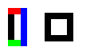
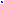

Nixel
=====
<sub>A pixel drawing utility in pure [nim](http://nim-lang.org/) - No external lib required</sub>

This is a simple lib that can draw `.png` files, abstracted over a fork of [nimage](https://github.com/haldean/nimage) that I got  
compiling again under [nim](http://nim-lang.org/) `0.14.2` (I opened a pull request for it, in the mean time use my [fork](https://github.com/stisa/nimage/) ). 

Currently you can:
  - Fill a surface with a color
  - Draw lines ( left to right, right to left, oblique )
  - Draw rectangles
  - Save a surface to png

**Bonus**: draw simple equations in the format `# + # =` ( or any other combination of  
numbers, spaces, `+` , `=` )

**NOTE**: if nimble doesn't pull nimage run:

```
 git submodule init
 git submodule update
```

Examples
--------


### [captcha.nim](examples/captcha.nim)
  

### [rect.nim](examples/rect.nim)

### [square.nim](examples/square.nim)
Mhh this one is a bit tiny 

See [examples](https://github.com/stisa/nixel/tree/master/examples) for code.

Documentation
-------------

See code comments, or view `nim doc2` output [at my site](http://stisa.space/nixel)

Plans
-----
- convenience function for creating `NColor`, maybe `proc rgba(r,g,b,a:float):NColor` ( `proc rgb()` too)
- nimage supports loading too, so verify and expose it. ( Requires `zlib` ?)
- support saving sdl2 surfaces ( and maybe loading too? )

License
-------

[MIT](https://github.com/stisa/nixel/LICENSE)

nimage: [BSD](https://github.com/haldean/nimage/blob/master/LICENSE)